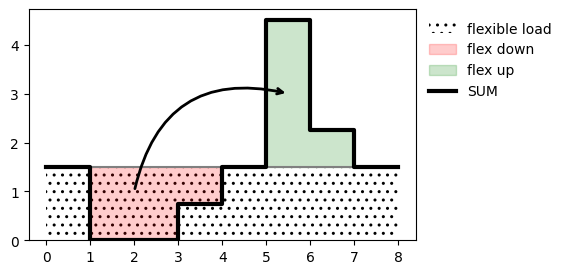

# Power Grid Investment Module - user guide 

Contents:

* [Modelling documentation](#modelling-documentation)
* [Examples](#examples)
* [What it does](#what-it-does)
* [Running an optimisation](#mrunning-an-optimisation)
* [Input data](#input-data)
    * [Grid data](#grid-data)
    * [Time sample](#time-sample)
    * [Parameters](#parameters)
* [Analysis of results](#analysis-of-results)
* [More about optimisation model](#more-about-the-powergim-optimisation-model)
* Extensions:
  * [Decomposition module](../src/powergim/dcmp_tools/README.md) (DCMP)

## Modelling documentation
A separate (draft) document provides more details about the modelling framework and
the theoretical context of the PowerGIM model.
This is available [here](files/PowerGIM.pdf).

## Examples
For a quick demonstration of how PowerGIM works, have a look at these
Jupyter notebooks:

1. Example of [deterministic](https://nbviewer.jupyter.org/urls/bitbucket.org/harald_g_svendsen/powergama/raw/master/powergama/examples/powergim_doggerbank/powergim_doggerbank.ipynb) optimisation
2. Example with added [stochastic](https://nbviewer.jupyter.org/urls/bitbucket.org/harald_g_svendsen/powergama/raw/master/powergama/examples/powergim_doggerbank/powergim_doggerbank_stochastic.ipynb) parameters

## What it does
PowerGIM is a module for grid investment analyses that is included with
the PowerGAMA python package. It is a power system *expansion planning* model
that can consider both transmission and generator investments.

PowerGIM works by finding the optimal investments amongst a set of specified
candidates such that the net present value of total system costs (capex and
opex) are minimised.

It is built on top of the [Pyomo](http://www.pyomo.org/) package.

### Two-stage optimisation
PowerGIM is formulated as a two-stage optimisation problem, and there may be
a time delay between the two investment stages. First-stage variables represent
the *here-and-now* investments that are of primary interest. Second-stage
variables include operational decisions and future investments.


### Uncertainty - stochastic programming
For many investment decisions it is important to consider uncertainties and
identify solutions that are good for all likely values of the uncertain
parameters. In the context of grid planning, relevant uncertainties are for
example future generator capacity and energy demand at different grid
locations, power prices. These things may have a huge impact on the benefit
of different investments alternatives.

Rather than just finding the optimal solution for a specific set of assumptions,
it is more relevant to find the solution that is best for the whole range of
potential realisations of the uncertain parameters.
This is *stochastic programming*.


PowerGIM includes this capability via the two-stage formulation. Uncertain
parametes and their potential values are specified via a *scenario tree*.

First stage variables (here-and-now decisions) are made without knowing
which scenario is realised, while second stage variables are different for the
different scenarios.


A simple example of a two-stage stochastic optimisation problem with three
scenarios (representing uncertainty about future wind farm capacities) and
their probabilities (P) is shown below:


### Flexible generation and consumption

Hydropower, and other generation with inflow and storage, is flexible but with a total energy availability (over a year) that is limited by the total inflow (over a year). This is accounted for by a maximum average powre output (capacity factor) and a constraint that limits the average output by this value.

Flexible demand is considered in a similar way.
_Shiftable_ load can be moved in time, but without changing the average value, as illustrated below.



In the model, load flexibility is specified as a certain fraction of the overall consumption. So the SUM consumption consists of a fixed load and a flexible load that can be shifted:


It is also possible to specify price sensitive load, with a given price cap below which the load is activated.


## Running an optimisation

See the [examples](#examples).

The general steps when using PowerGIM in a Python script/notebook
to specify and solve optimisation problems are:

Preparations:

1. Create input data sets (csv and yaml)
    * these specify existing infrastructure and candidate investments

Script:

2. Read input data and create optimisation model
3. Create model instance
    * for stochastic problem: specify scenario tree and model instance creation
  call-back function
4. Solve model
5. Save/inspect/analyse results


## Input data

### Grid data
Grid data is imported from CSV files. There are separate files for *nodes*, *branches*, *generators* and
*consumers*. Below, \<year\> refers to an investment year, and must match the years specified in the parameter value investment_year

#### Nodes
Node data are specified in a CSV file with one element per row, with
columns as shown below:

column | description | type | units
-------|-------------|------|------
id   | Unique string identifier | string
area | Area/country code | string
capacity_\<year\>  | (Additional) capacity installed before investment year \<year\>| float   | MW
expand_\<year\>    | Consider expansion in investment year \<year\>   | boolean | 0,1
lat  | Latitude   | float |degrees
lon  | Longitude  | float |degrees
offshore | Whether node is offshore | boolean | 0,1
cost_scaling | Cost scaling factor |float
type | Node (cost) type |string

#### Branches
Branch data are specified in a CSV file with one element per row, with
columns as shown below:

column | description | type | units
-------|-------------|------|------
node_from | Node identifier | string
node to   | Node identifier | string
capacity_\<year\>  | (Additional) capacity installed before investment year \<year\>| float   | MW
expand_\<year\>    | Consider expansion in investment year \<year\>   | boolean | 0,1
distance  | Branch length (OPT) | float | km
max_newCap    | Max new capacity (OPT) | float | km
cost_scaling  | Cost scaling factor | float
type      | Branch (cost) type | string

Branches have from and to references that must match a node identifier
in the list of nodes.
* distance may be left blank. Then distance is computed as the shortest
  distance between the associated nodes (based on lat/lon coordinates)
* expand_\<year\> is 0 if no expansion should be considered (not part of
  optimisaion)
* capacity_\<year\> is already decided (present or additional future) branch 
  capacity, i.e. it does not depend on the optimisation output


#### Generators
Generator data are specified in a CSV file with one element per row, with
columns as shown below:

column | description | type | units
-------|-------------|------|------
node  | Node identifier |string
desc  | Description or name (OPT) |string
type  | Generator type |string
capacity_\<year\>  | (Additional) capacity installed before investment year \<year\>  |float |MW
pmin  | Minimum production |float |MW
expand_\<year\> | Consider expansion in investment year \<year\>   | boolean | 0,1
allow_curtailment | Whether generator can be curtailed | boolean | 0,1
fuelcost_\<year\>  | Cost of generation in operating period \<year\> |float |€/MWh
fuelcost_ref  | Cost profile |string
inflow_fac  | Inflow factor |float
inflow_ref  | Inflow profile reference |string
pavg  | Average power output (OPT) |float |MW
p_maxNew  | Maximum new capacity (OPT) |float |MW
cost_scaling  | Cost scaling factor (OPT) |float
lat | latitude (OPT) | float | degrees
lon | longitude (OPT) | float | degrees

* The average power constraint (pavg) is used to represent generators
  with large storage. pavg=0 means no constraint on average output is used
  (no storage constraint).
* capacity_\<year\> is already decided (present or additional future) generator 
  capacity, i.e. it does not depend on the optimisation output
* If optional latitude/longitude are not given, they are inferred from the coordinates of the node where generator is connected


#### Consumers
Consumer (power demand) data are specified in a CSV file with one element per row, with
columns as shown below:

column | description | type | units
-------|-------------|------|------
node    | Node identifier  | string
demand_\<year\>  | (Additional) average demand at investment year <year>  |float |MW
demand_ref  | Profile reference |string

* There may be any number of consumers per node, although zero or one is
  typical.
* demand_\<year\> gives the average demand, which is easily computed from the
  annual demand if necessary.
* demand_ref gives the name of the demand profile (time sample) which gives
  the variation over time. Demand profiles should be normalised and have an annual
  average of 1.


### Time sample
A set of time series or samples are used to represent the variability in
renewable energy availability, power demand and generator fuel costs
(power prices).

These data are provided as a CSV file with one profile/sample per column, with
the column header being the profile string identifier, and one row per
timestamp.

the time samples are used together with base values to get demand, available
power and fuel costs at a given time as follows:

*demand(t) = demand_avg ×  demand_ref(t) fuelcost(t) = fuelcost ×  fuelcost_ref(t) pmax(t) =  (pmax+pmax2) × inflow_fac ×  inflow_ref(t)*


### Parameters
Investment costs and other parameters are provided in an YAML file with the
following structure:
```YAML
nodetype:
    ac: { L: 1e-6, S: 50}
    hvdc: { L: 1e-6, S: 1e-6 }
branchtype:
    <branchtype1>:
        B: 5.000
        Bdp: 1.15
        Bd: 0.656
        CL: 1.562
        CLp: 0
        CS: 4.813
        CSp: 0
        max_cap: 400
        loss_fix: 0
        loss_slope: 5e-5
    <branchtype2>:
        B: 5.000
        Bdp: 0.47
        Bd: 0.680
        CL: 0
        CLp: 0
        CS: 0
        CSp: 0
        max_cap: 2000
        loss_fix: 0
        loss_slope: 3e-5
gentype:
    <gentype1>:
       Cp: 0.010
       CO2: 0
    <gentype2>:
       Cp: 0
       CO2: 0
parameters:
    investment_years: [2025, 2028]
    finance_interest_rate: 0.05
    finance_years: 40
    operation_maintenance_rate: 0.05
    CO2_price: 0
    CO2_cap: null
    load_shed_penalty: 3000 # very high value of lost load (loadshedding penalty)
    profiles_period_suffix: False
    load_flex_shift_frac: {2025: 0.05, 2028: 0.08}
    load_flex_shift_max: {2025: 2, 2028: 2}
    load_flex_price_frac: {2025: 0, 2028: 0.05}
    load_flex_price_cap : {2025: 20, 2028: 20}
```

Most of the parametes in the  ```nodetype```, ```branchtype``` and ```gentype```
blocks are [cost parameters](#cost-model)
```branchtype``` has the following additional parameters related to
[power losses](#power-losses), and the maximum allowable
power rating per cable system (maxCap)

Parameters specified in the ```parameters``` block are:

* investment_years = list of years to consider for investments. The first value is the here-and-now (stage 1) investments. Use absolute values (e.g. [2030, 2040]) or relative values (e.g. [0, 5, 10]). The years specified here must match \<year\> in column names in the grud uboyt data,
* finance_interest_rate = discount rate used in net present value calculation of
  generation costs and operation and maintenance costs
* finance_years = financial lifetime of investments - the period over which
  the total costs are computed (years) starting from first investment year
* operation_maintenance_rate = fraction specifying the annual operation and maintenance costs
  relative to the investment cost
* CO2_price = costs for CO2 emissions (EUR/kgCO2)
* CO2_cap = cap on CO2 emissions, specified as global cap (float), per area (dict) or none (null)
* load_shed_penalty = penalty cost for load shedding (demand not supplied) (EUR/MWh)
* profiles_period_suffix = True/False specifying whether to use different profiles for each operating period, with a `_<period>` suffix to the profile name
* load_flex_shift_frac = amount of demand that can be shifted, as a fraction of demand_avg per consumer
* load_flex_shift_max = how many units of shiftable demand may be lumped together in any specific timestep
* load_flex_price_frac
* load_flex_price_cap


## Analysis of results

There are some different ways to analyse the optimisation results:

* save to CSV file and analyse with tool of choice
* plot on map (candidate investments / stage 1 result / stage 2 results),
using ```powergim.SipModel.extractResultingGridData(...)``` and ```powergama.plots.plotMap(...)```
* inspect variables directly using Pyomo functionality (pyomo is the python
  package used to formulate the optimisation problem)


## More about the PowerGIM optimisation model

### Cost model

##### Investment cost

Branches, Nodes and generators:

* *cost_b = B + Bbd ⋅ b ⋅ d + Bd ⋅ d + Σ(Cp ⋅ p + C)*
    * The sum is over the two branch endpoints, that may be on land or at sea.
    * d = branch distance (km)
    * p = power rating (GW)
    * B = fixed cost (MEUR)
    * Bdp = cost dependence on both distance and rating (MEUR/km/GW)
    * Bd = cost dependence on distance (MEUR/km)
    * C = fixed endpoint cost (CL=on land, CS=at sea) (MEUR)
    * Cp = endpoint cost dependence on rating (MEUR/GW)
* *cost_n = N*
    * N = fixed cost (NL=on land, NS=at sea)
* *cost_g = Gp ⋅ capacity*
    * Gp = generator cost per power rating (MEUR/GW)

*Present value vs future value(s)* - Present value factor (pv) for translating
future value to present value, and annuity factor (a) for translating
future cash flow to present value:

* pv(r,T0) = 1/(1+r)^T0
* a(r,T) = 1/r ⋅ [1 - 1/(1+r)^T]
    * T0 = year of investment (0 for stage 1)
    * T = number of periods (years) (financeYears)
    * r = discount rate (financeInterestrate)

Operation and maintenance (O&M) and salvage factors:

* *om_factor = omRate ⋅ [a(r,T1)-a(r,T0)]*
    * omRate = annual O&M cost as fraction of investment cost
* *salvage_factor = T0/T(1/(1+r)^(T-T0))*
    * salvage value is the remaining value after the financial lifetime
  (non-zero for investments in stage 2, since they have more life left than
    stage 1 investments)

Present value of investments including O&M costs and salvage value:

*pv_cost_inv = Σcost ⋅ pv ⋅ (1 + om_factor - salvage_factor)*

The sum is over all investments

##### Operational cost
Costs per year are:

*cost_op = sum over time sample { Pg ⋅ (fuelcost + emissionrate ⋅ CO2price)  + Pshed ⋅ VOLL } ⋅ samplefactor*

* Pg = generator output (MW)
* fuelcost = generator cost (EUR/MWh), including time profile
* emissionrate = CO2 emissions per power output (kgCO2/MWh)
* CO2price = CO2 tax
* Pshed = load shed (MW)
* VOLL = value of lost load (load shedding cost) (EUR/MWh)
* samplefactor = number of hours represented by value in time sample (hours)

Present value of generation costs:

*pv_cost_op = Σ cost_op ⋅ a*

The sum is over all generators.


##### Total costs
Total costs that is the objective function in the optimisation problem:

*cost = pv_cost_inv + pv_cost_op*


### Power losses

power out = power in (lossFix + lossSlope*d)

* lossFix = loss factor, fixed part
* lossSlope = loss factor dependence on branch distance (1/km)

### Variables
These are the optimisation problem variables

* v_branch_new_capacity = capacity of new branches
* v_branch_new_cables = number of new cables (integer)
* v_node_new_capacity = new node capacity
* v_new_nodes = number of new nodes (integer)
* v_gen_new_capacity = new generation capacity
* v_branch_flow12 = power flow on branch in positive direction
* v_branch_flow21 = power flow on branch in negative direction
* v_generation = generator output
* v_load_shed = load shedding
* v_load_flex_shift = load shifting (positive or negative)
* v_load_flex_price = price sensitive load (zero or positive)


### Constraints

Constraints are included for

1. Branch power flow is limited by branch capacity (in both directions)
2. New branch capacity requires new branches
3. A node is required at each branch endpoint
4. Generator output is limited by capacity and energy availability
5. Generator output average over entire time sample is limited by average power
available (energy limitation for storage generators)
6. CO2 emissions are limited by emission cap
7. Power balance at each node (branch power loss is included here)
